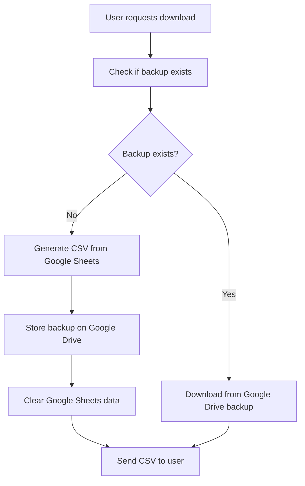

# Google Drive Integration Guide

## Overview

This guide covers the complete Google Drive integration for the Car Inventory Backend, including file storage, automatic cleanup, and download functionality. The system uses OAuth 2.0 for authentication and includes an API key for download operations.

## Table of Contents

1. [Architecture Overview](#architecture-overview)
2. [Authentication Setup](#authentication-setup)
3. [Environment Configuration](#environment-configuration)
4. [API Endpoints](#api-endpoints)
5. [File Storage Flow](#file-storage-flow)
6. [Download Flow](#download-flow)
7. [Cleanup System](#cleanup-system)
8. [Production Deployment](#production-deployment)
9. [Troubleshooting](#troubleshooting)

## Architecture Overview

The Google Drive integration consists of several components:

- **OAuth 2.0 Authentication**: For secure access to Google Drive
- **API Key**: For download operations (required by Google Drive API)
- **File Storage Service**: Manages inventory file backups
- **Automatic Cleanup**: Removes files after 30 days
- **Agency-based Organization**: Files stored in agency-specific folders

### Key Features

- ✅ **First Download**: Generates CSV from Google Sheets → Stores backup on Google Drive → Clears Google Sheets data
- ✅ **Subsequent Downloads**: Downloads existing backup from Google Drive (no new file generation)
- ✅ **Automatic Cleanup**: Files automatically deleted after 30 days
- ✅ **Agency Organization**: Files stored in agency-specific folders
- ✅ **Secure Access**: OAuth 2.0 + API key authentication

## Authentication Setup

### 1. Google Cloud Console Setup

#### Step 1: Create OAuth 2.0 Client ID

1. Go to [Google Cloud Console](https://console.cloud.google.com/)
2. Navigate to **APIs & Services** → **Credentials**
3. Click **Create Credentials** → **OAuth client ID**
4. Select **Desktop Application** (not Web Application)
5. Name: `Car Inventory System`
6. Click **Create**

#### Step 2: Download Credentials

1. Download the JSON file (e.g., `client_secret_xxx.apps.googleusercontent.com.json`)
2. Rename it to `google-drive-credentials.json`
3. Place it in the `credentials/` folder

#### Step 3: Configure OAuth Consent Screen

1. Go to **APIs & Services** → **OAuth consent screen**
2. Select **External** (if not already selected)
3. Fill in required information:
   - **App name**: `Car Inventory System`
   - **User support email**: Your email
   - **Developer contact information**: Your email
4. Add scopes:
   - `https://www.googleapis.com/auth/drive.file`
5. Add test users (your email)
6. **Important**: Publish the app (not just save)

#### Step 4: Create API Key

1. Go to **APIs & Services** → **Credentials**
2. Click **Create Credentials** → **API Key**
3. Name: `MH-Automotriz-Download`
4. Copy the API key (starts with `AIza...`)

### 2. Generate OAuth Tokens

#### Option A: Using the Setup Script

```bash
# Run the OAuth setup script
node scripts/setup-oauth-production.js

# Follow the prompts:
# 1. Enter the authorization code from the browser
# 2. The script will generate refresh and access tokens
```

#### Option B: Manual Token Generation

1. **Get Authorization Code**:
   ```bash
   node -e "
   const { google } = require('googleapis');
   const credentials = require('./credentials/google-drive-credentials.json');
   const oauth2Client = new google.auth.OAuth2(
     credentials.installed.client_id,
     credentials.installed.client_secret,
     'urn:ietf:wg:oauth:2.0:oob'
   );
   const authUrl = oauth2Client.generateAuthUrl({
     access_type: 'offline',
     scope: ['https://www.googleapis.com/auth/drive.file']
   });
   console.log('Visit this URL:', authUrl);
   console.log('Enter the authorization code:');
   "
   ```

2. **Exchange Code for Tokens**:
   ```bash
   node -e "
   const { google } = require('googleapis');
   const credentials = require('./credentials/google-drive-credentials.json');
   const oauth2Client = new google.auth.OAuth2(
     credentials.installed.client_id,
     credentials.installed.client_secret,
     'urn:ietf:wg:oauth:2.0:oob'
   );
   const code = 'YOUR_AUTHORIZATION_CODE_HERE';
   oauth2Client.getToken(code, (err, tokens) => {
     if (err) return console.error('Error:', err);
     console.log('Refresh Token:', tokens.refresh_token);
     console.log('Access Token:', tokens.access_token);
   });
   "
   ```

## Environment Configuration

Create or update your `.env` file with the following variables:

```env
# Google Drive Configuration
GOOGLE_DRIVE_INVENTORY_FOLDER_ID=your_main_folder_id_here
GOOGLE_DRIVE_RETENTION_DAYS=30
GOOGLE_DRIVE_CREDENTIALS_PATH=./credentials/google-drive-credentials.json

# OAuth Tokens
GOOGLE_REFRESH_TOKEN=your_refresh_token_here
GOOGLE_ACCESS_TOKEN=your_access_token_here

# API Key for Downloads
GOOGLE_API_KEY=your_api_key_here

# Google Sheets (existing)
GOOGLE_SHEETS_SPREADSHEET_ID=your_spreadsheet_id_here
GOOGLE_SHEETS_CREDENTIALS_PATH=./credentials/google-credentials.json
```

### Environment Variables Explained

| Variable | Description | Required |
|----------|-------------|----------|
| `GOOGLE_DRIVE_INVENTORY_FOLDER_ID` | Main folder ID where agency folders are created | Yes |
| `GOOGLE_DRIVE_RETENTION_DAYS` | Days before files are automatically deleted | Yes |
| `GOOGLE_DRIVE_CREDENTIALS_PATH` | Path to OAuth credentials JSON file | Yes |
| `GOOGLE_REFRESH_TOKEN` | OAuth refresh token for authentication | Yes |
| `GOOGLE_ACCESS_TOKEN` | OAuth access token for authentication | Yes |
| `GOOGLE_API_KEY` | API key for download operations | Yes |

## API Endpoints

### Download Inventory (Main Endpoint)

```http
GET /api/download/inventory/:agency/:month/:year/csv
```

**Behavior**:
- **First download**: Generates CSV from Google Sheets → Stores backup → Clears Google Sheets
- **Subsequent downloads**: Downloads existing backup from Google Drive

**Parameters**:
- `agency`: Agency name (e.g., "Alfa Romeo")
- `month`: Month number (e.g., "09")
- `year`: Year (e.g., "2025")

**Response**: CSV file download

### List Stored Files

```http
GET /api/download/stored-files/:agency
```

**Response**:
```json
{
  "success": true,
  "agency": "Alfa Romeo",
  "files": [
    {
      "id": "1ZQDXT_7fcLVVWy5oPY8fxDXtNq-dlDdZ",
      "name": "2025-09-23_Alfa Romeo_September_2025.csv",
      "mimeType": "text/csv",
      "size": 352,
      "createdTime": "2025-09-23T08:37:00.000Z",
      "modifiedTime": "2025-09-23T08:37:00.000Z",
      "webViewLink": "https://drive.google.com/file/d/..."
    }
  ],
  "count": 1
}
```

### Download Specific File

```http
GET /api/download/stored-file/:fileId
```

**Response**: File download

## File Storage Flow

### 1. First Download Process



### 2. File Organization

```
Google Drive Main Folder/
├── Alfa Romeo/
│   ├── 2025-09-23_Alfa Romeo_September_2025.csv
│   └── 2025-10-15_Alfa Romeo_October_2025.csv
├── Audi/
│   └── 2025-09-20_Audi_September_2025.csv
└── BMW/
    └── 2025-09-25_BMW_September_2025.csv
```

### 3. File Naming Convention

```
{YYYY-MM-DD}_{Agency}_{Month}_{YYYY}.csv
```

Example: `2025-09-23_Alfa Romeo_September_2025.csv`

## Download Flow

### Backend Logic

```javascript
// Check if backup exists
const storedFiles = await fileStorageService.getStoredFilesByAgency(agency);
const existingFile = storedFiles.find(file =>
  file.name.includes(`${agency}`) &&
  file.name.includes(`${month}`) &&
  file.name.includes(`${year}`)
);

if (existingFile) {
  // Download from Google Drive backup
  const fileData = await fileStorageService.downloadStoredFile(existingFile.id);
  res.send(fileData.content);
} else {
  // Generate from Google Sheets (first time)
  const inventoryData = await inventoryService.getInventoryDataForDownload(agency, month, year);
  const fileInfo = await downloadService.generateCSV(inventoryData);
  
  // Store backup before clearing
  await fileStorageService.storeInventoryFile(agency, month, year, 'csv');
  await inventoryService.clearAgencyDataAfterDownload(agency, month, year, inventoryData.sessionId);
  
  res.sendFile(fileInfo.filepath);
}
```

## Cleanup System

### Automatic Cleanup

Files are automatically deleted after 30 days (configurable via `GOOGLE_DRIVE_RETENTION_DAYS`).

**Important**: Only files are deleted, not folders. Agency folders are preserved.

### Cleanup Process

1. **Daily Check**: System checks for expired files
2. **File Deletion**: Only individual files are removed
3. **Folder Preservation**: Agency folders remain intact
4. **Logging**: All cleanup operations are logged

## Production Deployment

### 1. Environment Setup

```bash
# Set production environment variables
export NODE_ENV=production
export GOOGLE_DRIVE_INVENTORY_FOLDER_ID=your_production_folder_id
export GOOGLE_DRIVE_RETENTION_DAYS=30
export GOOGLE_REFRESH_TOKEN=your_production_refresh_token
export GOOGLE_ACCESS_TOKEN=your_production_access_token
export GOOGLE_API_KEY=your_production_api_key
```

### 2. OAuth App Configuration

1. **Publish OAuth App**: Ensure your OAuth app is published (not in testing mode)
2. **Add Production Domain**: Add your production domain to authorized origins
3. **Update Redirect URIs**: Add production redirect URIs if needed

### 3. API Key Security

- **Restrict API Key**: Limit to specific APIs (Google Drive API)
- **IP Restrictions**: Add production server IPs
- **Domain Restrictions**: Add production domains

### 4. Monitoring

Monitor the following logs:
- File storage operations
- Download operations
- Cleanup operations
- Authentication errors

## Troubleshooting

### Common Issues

#### 1. "The request is missing a valid API key"

**Cause**: API key not properly configured or not passed to Google Drive client

**Solution**:
```javascript
// Ensure API key is included in drive client initialization
this.drive = google.drive({
  version: 'v3',
  auth: this.auth,
  key: process.env.GOOGLE_API_KEY  // This is crucial
});
```

#### 2. "OAuth client not found"

**Cause**: Incorrect OAuth credentials or app not published

**Solution**:
- Verify OAuth credentials file path
- Ensure OAuth app is published in Google Cloud Console
- Check that client ID matches the credentials file

#### 3. "Access token expired"

**Cause**: Access token has expired and refresh token is not working

**Solution**:
- Generate new tokens using the setup script
- Update environment variables
- Restart the application

#### 4. "File not found" errors

**Cause**: Incorrect folder ID or file doesn't exist

**Solution**:
- Verify `GOOGLE_DRIVE_INVENTORY_FOLDER_ID` is correct
- Check that agency folders exist in Google Drive
- Ensure files are properly stored

### Debug Commands

```bash
# Test Google Drive connection
node -e "
const { OAuthGoogleDrive } = require('./src/services/oauthGoogleDrive');
const drive = new OAuthGoogleDrive();
drive.initialize().then(() => {
  console.log('✅ Google Drive connection successful');
}).catch(err => {
  console.error('❌ Google Drive connection failed:', err.message);
});
"

# Test file listing
curl -X GET "http://localhost:5000/api/download/stored-files/Alfa%20Romeo"

# Test file download
curl -X GET "http://localhost:5000/api/download/inventory/Alfa%20Romeo/09/2025/csv" -o test.csv
```

### Log Analysis

Look for these log patterns:

```
✅ Google API key found for download operations
✅ OAuth Google Drive service initialized successfully
📁 Found X files in [Agency] folder
📥 Downloading from Google Drive backup: [filename]
✅ Downloaded from backup: [filename]
```

Error patterns to watch for:
```
❌ Failed to store file on Google Drive
❌ Failed to download stored file
⚠️ No Google API key found - download operations may fail
```

## Security Considerations

1. **API Key Protection**: Never commit API keys to version control
2. **OAuth Token Security**: Store tokens securely in environment variables
3. **Scope Limitation**: Use only `https://www.googleapis.com/auth/drive.file` scope
4. **Access Control**: Regularly review and rotate credentials
5. **Monitoring**: Monitor for unauthorized access attempts

## Performance Optimization

1. **Caching**: OAuth tokens are cached and refreshed automatically
2. **Batch Operations**: Multiple file operations are batched when possible
3. **Error Handling**: Graceful fallbacks for network issues
4. **Logging**: Comprehensive logging for debugging and monitoring

## Support

For issues related to Google Drive integration:

1. Check the troubleshooting section above
2. Review application logs
3. Verify environment configuration
4. Test with debug commands
5. Contact the development team with specific error messages and logs
